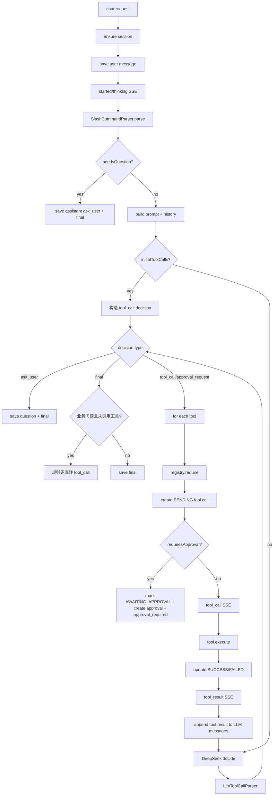

# AGENT_ARCHITECTURE_ANALYSIS

审计日期：2026-07-12  
目标：分析当前 Agent 的真实架构、调用链和主要缺陷。

## 1. 当前 Agent 模块组成

```text
backend/src/main/java/com/example/pvplatform/module/agent
├── controller
│   ├── AgentController.java
│   └── AgentApprovalController.java
├── dto
│   ├── AgentChatRequest.java
│   ├── AgentChatEvent.java
│   ├── AgentSessionDTO.java
│   ├── AgentMessageDTO.java
│   ├── AgentToolDTO.java
│   ├── AgentToolCallDTO.java
│   ├── AgentApprovalDTO.java
│   └── AgentApprovalDecision.java
├── entity / mapper
│   ├── AgentSessionDO / AgentSessionMapper
│   ├── AgentMessageDO / AgentMessageMapper
│   ├── AgentToolCallDO / AgentToolCallMapper
│   └── AgentApprovalDO / AgentApprovalMapper
├── llm
│   ├── AgentLlmClient.java
│   ├── DeepSeekAgentLlmClient.java
│   ├── LlmPromptBuilder.java
│   ├── LlmToolCallParser.java
│   ├── AgentLlmDecision.java
│   └── AgentToolCallSpec.java
├── service
│   ├── AgentOrchestratorService.java
│   ├── AgentSessionService.java
│   ├── AgentMessageService.java
│   ├── AgentToolService.java
│   ├── AgentApprovalService.java
│   ├── SlashCommandParser.java
│   ├── AgentToolIntent.java
│   ├── AgentProgressService.java
│   └── AgentJsonService.java
└── tool
    ├── AgentTool.java
    ├── AgentToolRegistry.java
    ├── ToolExecutionContext.java
    ├── ToolExecutionResult.java
    ├── ToolCategory.java
    ├── ToolPermissionLevel.java
    ├── AbstractAgentTool.java
    └── impl/*.java
```

前端目前主要集中在：

```text
web-frontend/src/views/AnalysisReport.vue
web-frontend/src/api/agent.ts
```

`AnalysisReport.vue` 是单文件大组件，内部包含会话栏、消息列表、SSE 事件处理、Slash command、工具卡片、审批卡片、Markdown 渲染、会话报告签名和打印样式。

## 2. 当前 Agent 入口

### 后端 API

| API | 代码 | 作用 |
| - | - | - |
| `POST /api/agent/chat/stream` | `AgentController.chatStream` | Agent SSE 主入口 |
| `POST /api/agent/sessions` | `AgentController.createSession` | 新建会话 |
| `GET /api/agent/sessions` | `AgentController.sessions` | 会话列表 |
| `GET /api/agent/sessions/{id}/messages` | `AgentController.messages` | 会话消息、工具调用、审批记录 |
| `GET /api/agent/sessions/{id}/tool-calls` | `AgentController.toolCalls` | 本会话工具调用 |
| `POST /api/agent/sessions/{id}/archive` | `AgentController.archive` | 归档 |
| `POST /api/agent/sessions/{id}/pin` | `AgentController.pin` | 固定 |
| `PUT /api/agent/sessions/{id}` | `AgentController.rename` | 重命名 |
| `DELETE /api/agent/sessions/{id}` | `AgentController.delete` | 逻辑删除 |
| `GET /api/agent/tools` | `AgentController.tools` | 工具描述列表 |
| `POST /api/agent/approvals/{id}/approve` | `AgentApprovalController.approve` | 确认/拒绝审批 |

### 前端 API

`web-frontend/src/api/agent.ts` 中：

- 普通接口使用 `request` 封装。
- SSE 使用原生 `fetch('/api/agent/chat/stream')`。
- token 从 `localStorage.getItem('token')` 读取并放入 Authorization header。
- SSE 解析逻辑读取 `data:` 行并反序列化为 `AgentSseEnvelope`。

## 3. 当前真实 Agent Loop

当前 Loop 在 `AgentOrchestratorService.runDecisionLoop` 中实现。



### 当前 Loop 的优点

- 有最大 5 轮保护。
- 工具调用前会持久化 PENDING。
- 工具成功/失败都会更新工具调用记录。
- 写/危险/成本工具默认需要确认。
- 工具结果回灌给 LLM，最终回答可以基于真实结果。
- LLM 不可用但已经有工具结果时，后端会返回工具结果摘要，而不是完全失败。

### 当前 Loop 的问题

- Planner、Executor、Memory、Evaluator 没有独立抽象。
- `initialToolCalls` 会绕过 LLM，直接由规则确定第一批工具。
- 综合分析拆工具在 `comprehensiveAnalysisCalls` 中硬编码。
- LLM 的 `llm_decision` 仍作为 SSE 事件发出，正式 UI 当前隐藏但协议层偏调试。
- 工具执行之间没有 typed artifact，只有 JSON 字符串和 `ToolExecutionResult`。
- 没有 Reflection：工具结果不完整时是否补查，主要靠模型下一轮判断。
- 没有 Result Verifier：最终回答是否引用真实字段、是否遗漏错误，未自动检查。

## 4. 当前 Tool System

### Tool 接口

`AgentTool` 定义：

- `name`
- `displayName`
- `category`
- `permissionLevel`
- `description`
- `inputSchema`
- `enabled`
- `requiresApproval`
- `execute`

`requiresApproval` 默认逻辑：

```text
permissionLevel != READ_ONLY
```

因此 `WRITE`、`DANGEROUS`、`COST`、`ADMIN` 均会走审批。

### Tool Registry

`AgentToolRegistry` 从 Spring 容器注入 `List<AgentTool>`，按 `tool.name()` 收集到 Map。

当前能力：

- `require(name)`：不存在或 disabled 则抛异常。
- `enabledTools(allowedNames)`：返回 enabled 工具，可被 allowedTools 过滤。
- `list()`：返回所有工具 DTO。

缺失：

- 没有按角色过滤工具列表。当前 Tool 自己在 execute 里做权限校验，Prompt 仍可能看到某些当前用户不可执行的工具。
- 没有工具版本号。
- 没有工具输入输出类型定义。
- 没有工具依赖关系，例如 `weather.current` 依赖 station 坐标。
- 没有工具风险解释 schema。

### 已注册工具状态

| 工具 | 分类 | 权限 | 状态 | 真实后端 |
| - | - | - | - | - |
| `station.list` | STATION | READ_ONLY | enabled | `StationService.list` |
| `station.detail` | STATION | READ_ONLY | enabled | `StationService.detail` + 权限 |
| `station.create` | STATION | WRITE | enabled | `StationService.create` |
| `station.update` | STATION | WRITE | enabled | `StationService.update` |
| `station.disable` | STATION | WRITE | enabled | `StationService.update` |
| `station.delete` | STATION | DANGEROUS | enabled | `StationService.delete` |
| `weather.current` | WEATHER | READ_ONLY | enabled | `WeatherService.current` |
| `weather.location` | WEATHER | READ_ONLY | enabled | `WeatherService.currentByLocation` |
| `prediction.list` | PREDICTION | READ_ONLY | enabled | `PredictionService.history` |
| `prediction.detail` | PREDICTION | READ_ONLY | enabled | `PredictionService.detail/results` |
| `report.generate` | REPORT | WRITE | enabled | `AnalysisService.report` |
| `report.conversation` | REPORT | READ_ONLY | enabled | `AgentMessageService.listWithDetails` |
| `report.list` | REPORT | READ_ONLY | enabled | `AnalysisService.history` |
| `report.detail` | REPORT | READ_ONLY | enabled | `AnalysisService.detail` |
| `model.list` | MODEL | READ_ONLY | enabled | `ModelService.list` |
| `model.detail` | MODEL | READ_ONLY | enabled | `ModelService.detail` |
| `model.run` | MODEL | COST | enabled | `PredictionService.create` |
| `cloud.predict` | CLOUD | COST | enabled | `CloudForecastService.predict` |
| `api.list` | API | READ_ONLY | enabled | `ApiKeyService.listOwn` |
| `api.usage` | API | READ_ONLY | enabled | `ApiCallLogService.ownLogs` |
| `api.create` | API | WRITE | enabled | `ApiKeyService.create` |
| `api.reset` | API | DANGEROUS | enabled | `ApiKeyService.resetOwn` |
| `api.delete` | API | DANGEROUS | enabled | `ApiKeyService.deleteOwn` |
| `wallet.balance` | WALLET | READ_ONLY | enabled | `OpenAccountService.wallet` |
| `marketplace.list` | MARKETPLACE | READ_ONLY | enabled | `OpenAccountService.plans` |
| `news.list` | NEWS | READ_ONLY | enabled | `NewsService` |
| `admin.userApi.list` | ADMIN | ADMIN | enabled | `ApiKeyService.adminList` |
| `marketplace.purchase` | MARKETPLACE | COST | disabled | 无真实购买接口 |
| `admin.station.manage` | ADMIN | ADMIN | disabled | 建议用细粒度 station 工具 |
| `admin.model.manage` | ADMIN | ADMIN | disabled | 未封装细粒度模型管理 |

## 5. 当前 Prompt 和 LLM

### LLM 客户端

`DeepSeekAgentLlmClient`：

- 使用 `LlmProperties` 中的 baseUrl/model/apiKey/temperature/maxTokens/timeout/jsonMode。
- 调用 `/chat/completions`。
- `stream=false`，所以模型 token 流式不是后端真实 LLM token 流。
- 如果 `jsonMode=true`，请求 `response_format: {type: "json_object"}`。
- 不打印 API Key。

### Parser

`LlmToolCallParser`：

- 尝试剥离 ```json 代码块。
- 从文本中截取第一个 `{` 到最后一个 `}`。
- 解析 `type/reason/toolCalls/answer/question`。
- 如果 `type=tool_call` 但无 toolCalls，则转 `ask_user`。
- 如果解析失败，则把原内容作为 `final` 的 answer。

问题：

- 解析失败后如果原内容是业务回答，可能进入业务 final 拦截；但如果没有规则可识别，仍可能成为普通 final。
- 没有 JSON Schema 校验。
- 没有 tool arguments 类型校验集中层，主要靠各工具 `longArg/stringArg`。

## 6. 当前 Slash Command

`SlashCommandParser` 支持：

- `/station [id]`
- `/weather [stationId|location]`
- `/predict [taskId]`
- `/report [stationId|conversation]`
- `/model [modelId]`
- `/api`

优先级：

```text
preferredTool > slash command > natural language rule
```

这和设计文档中常见的 “slash command > preferredTool > rule > LLM” 不完全一致。当前如果前端传了 `preferredTool`，会优先覆盖 slash。

自然语言规则：

- 命中“天气/weather” -> `weather.current` 或 `weather.location`
- 命中“报告/report” -> `report.generate` 或 `report.conversation`
- 命中“预测/任务” -> `prediction.list/detail`
- 命中“电站/station” -> `station.list/detail`
- 命中“api” -> `api.usage`
- 命中“模型/model” -> `model.list`

问题：

- 复杂意图仍然靠关键词和正则。
- “成都天气”走 `weather.location` 是合理的，但光伏平台业务天气和城市生活天气在体验上需要区分。
- “分析这个电站”会缺参追问；没有 Memory 可自动知道最近电站。

## 7. 当前前端 Agent 工作台

### 已有能力

- 会话列表、归档、固定、重命名、删除。
- 加载历史消息、工具调用、审批状态。
- SSE 事件处理：
  - `started`
  - `thinking`
  - `intent_resolved`
  - `plan`
  - `tool_call`
  - `tool_result`
  - `approval_required`
  - `token`
  - `final`
  - `error`
- 工具卡片使用 `summary/highlights`，不直接显示完整 JSON。
- 审批卡片支持确认/取消。
- Slash command 菜单支持上下键、Tab、Enter 选择。
- Assistant 内容用本地 Markdown 渲染函数。
- 会话报告支持手写签名和打印。

### 主要问题

- 页面逻辑过度集中在 `AnalysisReport.vue`。
- 没有独立 `AgentMessageList`、`AgentComposer`、`AgentToolCard`、`AgentApprovalCard`、`AgentRunSteps` 组件。
- 前端状态没有按 “run/task/step/artifact” 建模，只按消息临时拼接。
- `llm_decision/final_intercepted` 等调试事件没有 UI 展示，但也没有正式协议隔离。
- Markdown 渲染为本地正则实现，不是成熟 Markdown parser，存在兼容性和安全边界问题。
- 会话和任务仍容易被业务对象误解；UI 需要强调“Agent 会话属于用户，电站/任务只是工具参数”。

## 8. 为什么当前不像 Codex

1. **没有任务运行对象**  
   Codex 风格体验里，用户看到的是一个 task/run：有目标、计划、命令、结果和修复。当前只有 chat message。

2. **没有可审计 Planner**  
   当前 plan 事件只是工具名列表，无法解释“为什么先查 A 再查 B，何时够用，何时重试”。

3. **工具结果没有形成 artifact**  
   当前工具结果保存为 JSON result，前端展示摘要；但没有 “天气摘要 artifact”、“预测趋势 artifact”、“报告草稿 artifact”。

4. **Memory 太短**  
   只取最近 8 条消息，不能形成稳定上下文。

5. **缺少反思和校验**  
   LLM 总结后没有验证是否引用工具结果、是否忽略失败、是否编造字段。

6. **业务工具不够完整**  
   光伏运维 Agent 需要功率数据、辐照度、设备状态、异常检测、告警、历史对比。当前核心只有 station/weather/prediction/report。

7. **UI 没有展示“工作台”结构**  
   目前更像带工具卡的聊天页面。未来应将中间区域拆成“对话 + 当前运行进度 + 业务结果 artifact + 后续操作”。

## 9. 当前最应优先改的 5 个问题

1. **引入 Agent Run / Step 数据模型**  
   不再只靠 SSE 临时事件展示过程。新增 `agent_run`、`agent_run_step` 或至少在 metadata 中稳定保存 run/step。

2. **拆分 Planner / Executor / Memory / Evaluator**  
   从 `AgentOrchestratorService` 中拆出独立模块，减少 if/else 和 prompt 规则堆叠。

3. **补齐光伏分析核心工具**  
   新增 `power.current`、`power.history`、`power.compare`、`power.anomaly`、`weather.forecast`、`station.status`。

4. **实现 Skill 层**  
   把综合分析、天气影响、预测诊断、报告生成封装成业务 Skill，Planner 选择 Skill，Skill 再选择工具。

5. **前端组件化和执行轨迹产品化**  
   拆分 Agent 页面组件，统一展示 run steps、tool summaries、approval、final answer、artifact，不展示调试 JSON。

## 10. 结论

当前 Agent 已经有“可跑通的工具调用闭环”，不是普通聊天机器人；但它仍不是成熟的业务 Agent Runtime。下一阶段不应该继续堆单个工具，而应建立：

- Run/Step 生命周期
- Planner
- Memory
- Skill
- Tool Schema/Executor
- Evaluator
- Artifact
- 正式 Agent UI 组件体系

这样才能从“能调用工具的聊天页面”升级为“光伏智能运维 Agent”。
