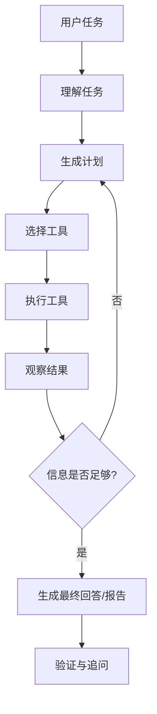
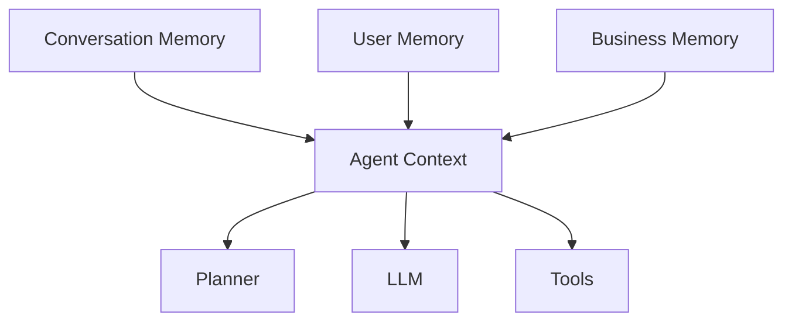

# AWESOME_LLM_APPS_REFERENCE

参考来源：

- GitHub: https://github.com/Shubhamsaboo/awesome-llm-apps
- README 原文说明该仓库覆盖 AI Agents、Always-on Agents、Multi-agent Teams、MCP Agents、RAG、Voice Agents、Agent Skills、Fine-tuning 等类别，并强调这些是可运行模板，而不是只收集链接。

本文不复制仓库代码，只抽取适合智能光伏预测平台的 Agent 设计思想。

## 1. 参考仓库给当前项目的启发

`awesome-llm-apps` 的价值不是某个具体文件，而是它把现代 LLM 应用拆成几个可组合范式：

| 范式 | 对光伏平台的意义 |
| - | - |
| Starter Agent | 单一任务快速跑通，例如查询天气、查询电站 |
| Advanced Agent | 多工具、多步骤、带记忆和推理的生产式 Agent |
| Always-on Agent | 定时巡检电站、预测失败告警、天气风险提醒 |
| Multi-agent Team | 规划、诊断、报告、审核等多角色协作 |
| Agentic Frontend / Generative UI | Agent 不是只输出文本，而是输出卡片、图表、计划、表单和报告 |
| MCP Agent | 将业务能力封装成标准工具服务，便于多模型、多 Agent 复用 |
| RAG | 接入平台文档、设备说明、历史报告、运维知识库 |
| Memory | 记住用户、电站上下文、报告偏好和长期业务状态 |
| Agent Skill | 把可复用流程打包成技能，例如功率波动分析、预测诊断 |
| Evaluation | 对 Agent 输出进行自动验收，避免只靠人工体验 |

## 2. Agent Loop

### 通用 Agent Loop

适合迁移到当前项目的循环：



当前项目已经有：

- 用户任务
- 规则/LLM 选择工具
- 执行工具
- 工具结果回灌
- 最终回答

当前项目缺失：

- 独立 Planner
- 显式 Plan 数据结构
- Observation/Artifact 模型
- Reflection
- Evaluation

### 迁移到 Spring Boot 的建议

新增后端包：

```text
module/agent/runtime
├── AgentRuntimeService.java
├── AgentRunService.java
├── AgentStepService.java
├── AgentState.java
└── AgentRunContext.java

module/agent/planner
├── AgentPlanner.java
├── RuleBasedPlanner.java
├── LlmPlanner.java
└── Plan.java

module/agent/executor
├── ToolExecutor.java
├── SkillExecutor.java
└── ExecutionObserver.java

module/agent/evaluation
├── AgentAnswerEvaluator.java
└── ToolGroundingVerifier.java
```

流程：

1. `AgentController` 仍接收 `/chat/stream`。
2. `AgentRuntimeService` 创建 `AgentRun`。
3. `Planner` 生成 `Plan`。
4. `Executor` 按 Step 调工具或 Skill。
5. `Evaluator` 验证最终回答是否基于工具结果。
6. SSE 只推送产品化事件：`run_started`、`step_started`、`step_completed`、`approval_required`、`answer_delta`、`run_completed`、`run_failed`。

## 3. Tool System

### 参考设计

现代 Agent 工具通常具备：

- name
- description
- input schema
- output schema
- permission/risk level
- execution handler
- timeout/retry policy
- result formatter
- examples
- enabled/disabled reason

当前项目已有：

- `AgentTool`
- `AgentToolRegistry`
- `ToolExecutionContext`
- `ToolExecutionResult`
- 权限等级
- enabled
- inputSchema
- summary/highlights

目标升级：

```java
public interface AgentTool {
    ToolDefinition definition();
    ToolValidationResult validate(JsonNode args, AgentRunContext context);
    ToolExecutionResult execute(AgentRunContext context, JsonNode args);
    ToolDisplayResult format(ToolExecutionResult result);
}
```

建议新增：

| 对象 | 作用 |
| - | - |
| `ToolDefinition` | 工具元数据和 schema |
| `ToolInputSchema` | JSON Schema 或 Java record schema |
| `ToolOutputSchema` | 结构化输出类型 |
| `ToolRiskPolicy` | 是否需要确认、确认文案、风险等级 |
| `ToolDisplayFormatter` | 将 raw data 转业务摘要 |
| `ToolDependency` | 表达工具依赖，例如天气依赖 station 坐标 |

### 映射光伏工具

| 业务对象 | Tool | 说明 |
| - | - | - |
| 电站 | `station.list/detail/create/update/delete` | 已有，需强化 output schema |
| 天气 | `weather.current/location/forecast` | 已有 current/location；应补 forecast |
| 功率数据 | `power.current/history/compare/anomaly` | 当前缺失，必须补 |
| 预测 | `prediction.list/detail/run` | 已有 list/detail；`model.run` 命名应重新设计 |
| 报告 | `report.generate/conversation/list/detail` | 已有；需区分正式报告和会话总结 |
| 模型 | `model.list/detail/run` | 已有；需加强成本/确认策略 |
| API | `api.list/usage/create/reset/delete` | 已有；需使用 usage summary 而非仅 logs |
| 钱包 | `wallet.balance` | 已有；支付/购买保持 disabled |
| 新闻 | `news.list` | 已有；通知工具缺失 |

## 4. Memory System

### 参考设计

Memory 分为三层：



### 当前项目已有

- `agent_message` 保存完整会话消息。
- `AgentOrchestratorService.appendHistory` 取最近 8 条 user/assistant。
- `agent_tool_call` 保存工具调用结果。

### 当前项目缺失

- 没有总结型短期记忆。
- 没有长期用户偏好。
- 没有 station context memory。
- 没有常用 task/report/model 记忆。
- 没有向量检索或业务知识 RAG。

### 建议设计

| Memory | 存储 | 内容 |
| - | - | - |
| Conversation Memory | `agent_message` + `agent_session_summary` | 最近对话、会话摘要、当前目标 |
| User Memory | `agent_user_memory` | 常用电站、默认报告格式、语言偏好 |
| Station Context Memory | `agent_station_memory` 或动态查询缓存 | 最近分析的电站、最近任务、关注指标 |
| Report Memory | `analysis_report` + `agent_artifact` | 已生成报告、报告草稿、签名状态 |
| Tool Memory | `agent_tool_call` | 已查过的工具结果，避免重复查询 |
| Knowledge Memory | 向量库/全文索引 | 运维手册、平台文档、模型说明 |

## 5. Planning

### 当前项目问题

`AgentOrchestratorService.comprehensiveAnalysisCalls` 里硬编码：

- 如果消息包含“分析/波动/原因/综合”
- 且包含天气/预测/功率/发电
- 且有 stationId
- 则直接调用 `station.detail`、`weather.current`、`prediction.list/detail`

这是规则调度，不是 Planner。

### 目标 Planner

输入：

```json
{
  "userTask": "分析 2 号电站今天功率波动，结合天气和预测",
  "context": {},
  "memory": {},
  "availableTools": [],
  "constraints": {
    "maxSteps": 8,
    "requireApprovalForWrite": true
  }
}
```

输出：

```json
{
  "intent": "POWER_FLUCTUATION_ANALYSIS",
  "missingInfo": [],
  "steps": [
    {"id":"s1","type":"tool","tool":"station.detail","args":{"stationId":2},"purpose":"确认电站基础信息"},
    {"id":"s2","type":"tool","tool":"power.history","args":{"stationId":2,"range":"today"},"purpose":"读取今日功率曲线"},
    {"id":"s3","type":"tool","tool":"weather.current","args":{"stationId":2},"purpose":"判断天气影响"},
    {"id":"s4","type":"tool","tool":"prediction.list","args":{"stationId":2},"purpose":"查找最近预测任务"},
    {"id":"s5","type":"reasoning","purpose":"综合判断波动原因"}
  ]
}
```

Planner 不应该直接写死在 Controller 或 Orchestrator 中。

## 6. Multi-step Execution

### 推荐执行模型

```text
AgentRun
  - runId
  - sessionId
  - userId
  - userTask
  - status
  - startedAt
  - completedAt

AgentRunStep
  - stepId
  - runId
  - type: PLAN | TOOL | APPROVAL | REASONING | FINAL
  - name
  - status
  - inputJson
  - outputJson
  - summary
  - errorMessage
```

好处：

- 前端刷新后仍能恢复执行过程。
- E2E 测试能断言真实执行步骤。
- 可以对失败步骤重试。
- 可以生成审计报告。

## 7. Agent Skills

### 参考思想

Skill 是比 Tool 更高层的业务能力。Tool 是单个操作，Skill 是一组流程、工具、提示词和结果格式。

### 光伏平台建议 Skill

| Skill | 目标 | 依赖工具 |
| - | - | - |
| `PowerAnalysisSkill` | 分析功率波动、发电下降、异常原因 | `station.detail`、`power.history`、`weather.current`、`weather.forecast`、`prediction.list/detail` |
| `WeatherImpactSkill` | 判断天气对发电影响 | `station.detail`、`weather.current`、`weather.forecast`、`power.history` |
| `PredictionDiagnosisSkill` | 解读预测任务结果和风险 | `prediction.detail`、`model.detail`、`power.history` |
| `ReportGenerationSkill` | 生成正式报告 | `report.generate`、`report.conversation`、`analysis.report.export` |
| `ModelSelectionSkill` | 根据场景推荐预测模型 | `model.list`、`model.detail`、历史指标 |
| `ApiUsageSkill` | 解释开放 API 使用和异常 | `api.usage`、`api.list`、`wallet.balance` |
| `StationOpsSkill` | 电站信息维护和权限检查 | `station.list/detail/update/disable` |

Skill 定义建议：

```java
public interface AgentSkill {
    SkillDefinition definition();
    boolean supports(AgentTask task, AgentRunContext context);
    Plan plan(AgentTask task, AgentRunContext context);
    SkillResult synthesize(List<ToolExecutionResult> observations);
}
```

## 8. MCP 思想

### 是否应该做 MCP Server

短期：不建议马上引入 MCP 到生产链路。当前 Spring Boot 内部 Tool Bean 更易控制权限、事务和脱敏。

中期：建议把业务能力设计成“可 MCP 化”的边界：

- Tool schema 标准化。
- 输入输出 JSON Schema 明确。
- 认证上下文独立。
- 工具执行和 HTTP Controller 解耦。
- 工具可被 Spring Agent Runtime 或外部 MCP Server 复用。

长期：可以提供内部 MCP Server：

```text
pv-platform-mcp-server
├── station tools
├── weather tools
├── power tools
├── prediction tools
├── report tools
├── model tools
└── api/wallet tools
```

适用场景：

- 让 Codex/Claude Desktop/其他 Agent 安全调用平台能力。
- 把业务工具和 UI 解耦。
- 多模型、多 Agent 共用同一工具协议。

风险：

- 权限和审计必须严格。
- API Key/token 不得暴露给外部 Agent。
- 写操作必须确认。
- 数据范围必须绑定用户/租户。

## 9. Conversation Management

参考仓库里的 memory/chat 类应用说明：会话不是简单消息数组，而是状态载体。

当前项目应将会话升级为：

```text
AgentSession
  - 会话元信息
  - 会话摘要
  - 当前目标
  - 最近业务对象
  - 关联 runs
  - 关联 artifacts
```

前端会话栏只显示用户会话，不应该和电站绑定；电站、任务、报告是工具调用参数或 artifact。

## 10. 对当前项目的落地优先级

1. `AgentRun` 和 `AgentRunStep`，先让过程可持久化。
2. `PowerAnalysisSkill`，解决用户最核心的“功率波动分析”体验。
3. `power.history` 和 `weather.forecast` 工具，补业务数据缺口。
4. `Planner` 抽象，替换 Orchestrator 内硬编码流程。
5. `Memory` 摘要和常用上下文，减少反复要求 stationId。
6. 前端组件化，按 Run/Step/Artifact 展示。
7. 评估脚本，固定核心场景回归。
