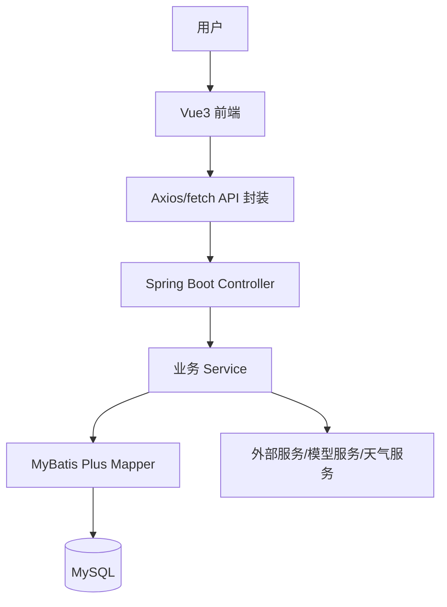
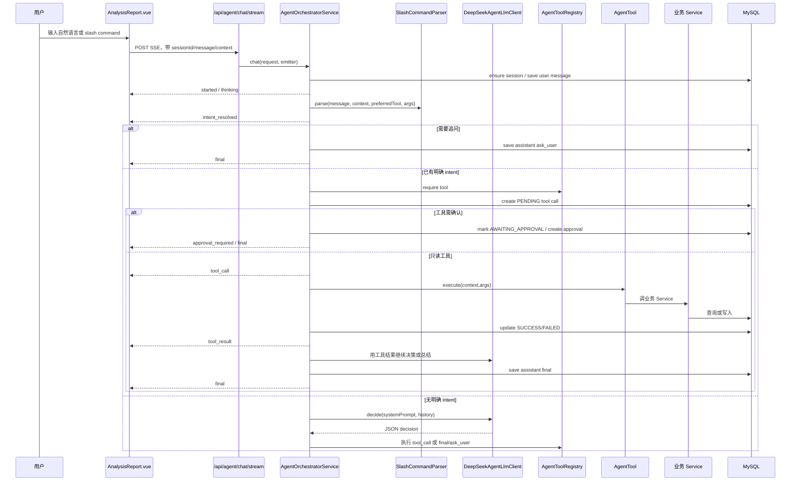

# CURRENT_PROJECT_CAPABILITY

审计日期：2026-07-12  
审计范围：`backend/src/main/java`、`backend/src/main/resources`、`web-frontend/src`、`scripts`

本文只记录当前代码中已经确认存在的能力，不把历史开发总结当作事实。

## 1. 当前系统整体架构

### 传统业务链路



当前业务模块已经形成较完整的 Spring Boot 单体应用：

- 用户与权限：`module/user`、`security`
- 电站：`module/station`
- 天气：`module/weather`
- 预测：`module/prediction`、`client/ModelServiceClient`
- 报告：`module/analysis`
- 模型广场：`module/model`
- API 开放平台：`module/openapi`
- 新闻通知：`module/news`
- Agent：`module/agent`

### Agent 业务链路

```mermaid
flowchart TD
    U[用户] --> AR[/reports Agent 工作台]
    AR --> SSE[POST /api/agent/chat/stream]
    SSE --> AO[AgentOrchestratorService]
    AO --> SP[SlashCommandParser / 规则意图]
    AO --> PB[LlmPromptBuilder]
    AO --> DS[DeepSeekAgentLlmClient]
    DS --> Parser[LlmToolCallParser]
    AO --> TR[AgentToolRegistry]
    TR --> T[AgentTool 实现]
    T --> BS[业务 Service]
    BS --> DB[(MySQL)]
    BS --> EXT[天气/模型/开放平台等外部能力]
    AO --> MSG[agent_message / agent_tool_call / agent_approval]
    AO --> AR
```

Agent 当前不是纯前端模拟：后端已有 SSE、会话持久化、工具注册、工具执行、审批和 DeepSeek JSON ReAct 调用。但 Agent Runtime 仍然集中在一个 Orchestrator 中，尚未拆成 Planner / Memory / Skill / Executor 等独立层。

## 2. 当前已有业务能力

| 能力 | 接口 | Service | 是否 Agent 可调用 | 状态 |
| - | - | - | - | - |
| 电站列表 | `GET /api/stations` | `StationService.list` | 是，`station.list` | 可用；按当前用户权限过滤 |
| 电站详情 | `GET /api/stations/{stationId}` | `StationService.detail` | 是，`station.detail` | 可用；工具显式调用 `StationPermissionService.requireView` |
| 电站创建 | `POST /api/admin/stations` | `StationService.create` | 是，`station.create` | 已注册写工具，需确认；更适合管理员 |
| 电站更新 | `PUT /api/admin/stations/{stationId}` | `StationService.update` | 是，`station.update` | 已注册写工具，需确认；参数完整性需加强 |
| 电站删除 | `DELETE /api/admin/stations/{stationId}` | `StationService.delete` | 是，`station.delete` | 已注册危险工具，需确认 |
| 电站停用 | 无单独 Controller；工具复用更新逻辑 | `StationService.update` | 是，`station.disable` | 已注册写工具，需确认 |
| 当前天气 | `GET /api/stations/{stationId}/weather/current` | `WeatherService.current` | 是，`weather.current` | 可用；依赖电站经纬度和天气配置 |
| 地点天气 | `GET /api/weather/current?location=` | `WeatherService.currentByLocation` | 是，`weather.location` | 可用；便于用户问城市天气 |
| 天气预报 | `GET /api/stations/{stationId}/weather/forecast` | `WeatherService.forecast` | 否，未见 `weather.forecast` 工具 | 业务接口有，Agent 工具缺失 |
| PV 采集数据 | `pv_data` 表，相关导入/查询散落模块 | `PvDataMapper` / dashboard 等 | 否，未见 `power.history` 或 `pv.data.query` 工具 | Agent 无法严肃分析“功率波动”的关键缺口 |
| 预测任务创建 | `POST /api/predictions` | `PredictionService.create` | 是，`model.run` | 已注册成本工具，需确认；命名不直观 |
| 预测历史 | `GET /api/predictions/history` | `PredictionService.history` | 是，`prediction.list` | 可用；按 stationId 可过滤 |
| 预测详情 | `GET /api/predictions/{taskId}` + `/results` | `PredictionService.detail/results` | 是，`prediction.detail` | 可用；工具汇总趋势和功率范围 |
| 分析报告生成 | `POST /api/analysis/report` | `AnalysisService.report` | 是，`report.generate` | 可用；写 `analysis_report`，需确认 |
| 报告列表 | `GET /api/analysis/reports` | `AnalysisService.history` | 是，`report.list` | 可用 |
| 报告详情 | `GET /api/analysis/reports/{reportId}` | `AnalysisService.detail` | 是，`report.detail` | 可用 |
| 会话工作报告 | 无传统业务接口 | `ConversationReportTool` 读取 Agent 会话 | 是，`report.conversation` | 可用；不写 `analysis_report`，生成 Markdown |
| 模型列表 | `GET /api/models` | `ModelService.list` | 是，`model.list` | 可用 |
| 模型详情 | `GET /api/models/{modelId}` | `ModelService.detail` | 是，`model.detail` | 可用 |
| 云图预测 | `POST /api/cloud-forecast` | `CloudForecastService.predict` | 是，`cloud.predict` | 已注册成本工具；需要真实图片输入 |
| API Key 列表 | `GET /api/open/keys` | `ApiKeyService.listOwn` | 是，`api.list` | 可用；工具脱敏 |
| API Key 创建 | `POST /api/open/apply-key` | `ApiKeyService.create` | 是，`api.create` | 写工具，需确认；完整 Key 不进入 Agent 展示 |
| API Key 重置 | `POST /api/open/keys/{id}/reset` | `ApiKeyService.resetOwn` | 是，`api.reset` | 危险工具，需确认；脱敏 |
| API Key 删除 | `DELETE /api/open/keys/{id}` | `ApiKeyService.deleteOwn` | 是，`api.delete` | 危险工具，需确认 |
| API 使用日志 | `GET /api/open/call-logs` / usage summary | `ApiCallLogService` | 是，`api.usage` | 可用；当前工具取最近日志而非完整统计汇总 |
| 钱包余额 | `GET /api/open/wallet` | `OpenAccountService.wallet` | 是，`wallet.balance` | 可用，只读 |
| 市场套餐列表 | `GET /api/open/plans` | `OpenAccountService.plans` | 是，`marketplace.list` | 可用，只读 |
| 购买套餐 | 无真实购买扣费接口 | 无对应完整 Service | 否，`marketplace.purchase` disabled | 已禁用 |
| 新闻列表 | `GET /api/news` | `NewsService` | 是，`news.list` | 可用 |
| 通知 | `GET /api/notifications` | `NotificationService` | 否，未见 Agent 工具 | 业务接口有，Agent 工具缺失 |
| 管理用户 API | `GET /api/admin/api-keys` | `ApiKeyService.adminList` | 是，`admin.userApi.list` | 已注册 ADMIN 工具 |
| 管理端综合电站/模型 | 多个 admin 接口 | 多个 Service | 部分禁用 | `admin.station.manage`、`admin.model.manage` disabled |

## 3. 当前数据库能力

### 用户/权限相关

- `sys_user`
- `sys_role`
- `sys_user_role`
- `user_station_permission`
- `sys_login_log`
- `sys_oauth_account`
- `sys_face_auth`

### 光伏业务相关

- `power_station`
- `external_pv_station`
- `external_pv_station_status`
- `pv_data`
- `pv_data_import_task`
- `weather_data`
- `model_info`
- `model_metric`
- `model_file`
- `prediction_task`
- `prediction_input_snapshot`
- `prediction_result`
- `analysis_report`

### 开放平台相关

- `api_key`
- `api_call_log`
- `open_wallet_account`
- `open_wallet_record`
- `open_recharge_order`

### Agent 相关

`backend/src/main/resources/sql/agent_tables_migration.sql` 确认存在：

- `agent_session`
- `agent_message`
- `agent_tool_call`
- `agent_approval`

关键字段：

| 表 | 关键字段 | 当前用途 |
| - | - | - |
| `agent_session` | `session_id,user_id,title,archived,pinned,status,deleted,created_at,updated_at` | 当前用户 Agent 会话列表 |
| `agent_message` | `message_id,session_id,user_id,role,content,metadata_json,created_at` | 保存 user/assistant 消息 |
| `agent_tool_call` | `tool_call_id,session_id,message_id,user_id,client_tool_call_id,tool_name,display_name,arguments_json,result_json,status,error_message,duration_ms` | 保存工具调用和脱敏结果 |
| `agent_approval` | `approval_id,session_id,user_id,tool_call_id,tool_name,status,reason,arguments_json,comment,decided_at,created_at` | 保存用户确认请求 |

## 4. 当前 Agent 能力

### 已实现且经代码确认

| 能力 | 代码位置 | 说明 |
| - | - | - |
| SSE 入口 | `AgentController.chatStream` | `POST /api/agent/chat/stream`，返回 `SseEmitter` |
| 会话 CRUD | `AgentController` + `AgentSessionService` | 创建、列表、归档、固定、重命名、逻辑删除 |
| 消息持久化 | `AgentMessageService` | 保存消息，并加载关联工具调用/审批 |
| 工具调用持久化 | `AgentToolService` | PENDING -> SUCCESS/FAILED/AWAITING_APPROVAL |
| 敏感字段脱敏 | `AgentToolService.mask` | 对 key/token/password/secret 等字段脱敏 |
| 工具注册 | `AgentToolRegistry` | 从 Spring Bean 列表收集工具 |
| 工具描述接口 | `GET /api/agent/tools` | 返回 `AgentToolDTO` |
| 用户确认 | `AgentApprovalService` + `AgentApprovalController` | approve/reject；继续执行需再次调用 chat stream 并带 `approvalId` |
| DeepSeek Agent 调用 | `DeepSeekAgentLlmClient` | 非流式 `/chat/completions`，JSON mode 可配置 |
| JSON 决策解析 | `LlmToolCallParser` | 解析 `type/toolCalls/answer/question` |
| Prompt 构造 | `LlmPromptBuilder` | 动态注入用户、上下文、可用工具 |
| Slash 解析 | `SlashCommandParser` | 支持 `/station`、`/weather`、`/predict`、`/report`、`/model`、`/api` |
| 业务 final 拦截 | `AgentOrchestratorService` | 业务问题若 LLM 直接 final，后端尝试规则兜底为工具调用 |
| 最大循环保护 | `MAX_TOOL_LOOPS = 5` | 防止无限工具调用 |
| 前端 SSE 解析 | `web-frontend/src/api/agent.ts` | 使用 `fetch + ReadableStream` |
| 前端消息/工具/审批展示 | `AnalysisReport.vue` | 单文件实现，会话栏、消息流、工具卡、审批卡、签名 |

### 当前不是完整 Agent Runtime 的部分

- 没有独立 Planner 模块。
- 没有长期记忆表，例如用户偏好、常用电站、常用模型、报告偏好。
- 没有业务 Skill 抽象，所有工具和流程集中在 Orchestrator、Prompt、规则解析里。
- 没有任务状态表，例如一个长任务的 plan、step、reflection、artifacts。
- 没有 Reflection/Evaluator，工具结果是否足够支撑最终回答主要交给 LLM。
- 没有 MCP Server，工具是 Java 内部 Bean。
- 前端 Agent 页面是一个大型 Vue 单文件组件，组件边界弱。

## 5. 当前 Agent 调用链



真实存在：

- 会话、消息、工具调用、审批持久化。
- 动态工具列表注入 Prompt。
- Slash/自然语言规则兜底。
- Tool call -> Tool result -> LLM summary 的循环。

只是部分设计或不完整：

- Planner 不是独立模块。
- 多步骤任务拆解是规则和 LLM 的混合，不是可审计 plan。
- 记忆只取最近 8 条消息，不是多层 Memory。
- 工具间依赖没有统一数据总线，例如 `prediction.list` 返回后不会自动选择最新 task 继续 `prediction.detail`，除非 LLM 再决策。

## 6. 当前问题

1. **不像 Codex 的根因**：当前 Agent 没有“任务对象”和“执行计划”作为一等概念，页面只是把 SSE 事件拼成消息，而不是展示一个可追踪的 plan/step/artifact 生命周期。
2. **用户感受不到 Agent 在做事**：后端虽然推送 `thinking/tool_call/tool_result/final`，但工具步骤摘要依赖各工具 summary，缺少统一 Step Model、阶段状态、重试、反思和 artifact。
3. **工具影响最终回答但不稳定**：工具结果会回灌给 LLM，但最终质量取决于 Prompt 和模型；没有结构化 answer schema、引用检查或 evaluator。
4. **工具选择不够自主**：优先级是 slash/preferred/rule/LLM；很多业务问题由 `SlashCommandParser` 和 `comprehensiveAnalysisCalls` 决定，不是 Planner 生成的可解释计划。
5. **功率分析能力缺口大**：数据库有 `pv_data`，但 Agent 缺少 `power.current`、`power.history`、`power.anomaly` 等工具，因此“功率波动原因”只能结合天气/预测泛化分析。
6. **Memory 弱**：仅加载最近 8 条 user/assistant 历史，没有用户偏好、常用电站、最近任务、报告样式、已确认偏好等记忆。
7. **Skill 缺失**：PowerAnalysis、WeatherImpact、PredictionDiagnosis、ReportGeneration 没有封装成可复用技能。
8. **审批续跑不自动**：审批接口只更新审批状态，继续执行需要前端再调用 `/chat/stream` 并带 `approvalId`。
9. **前端组件边界弱**：`AnalysisReport.vue` 集中了会话、SSE、消息、工具卡、审批、签名、打印和样式，维护成本高。
10. **调试事件仍从后端发送**：`llm_decision`、`final_intercepted` 仍在 SSE 中；前端当前不直接展示，但协议层未区分 dev/prod event。
