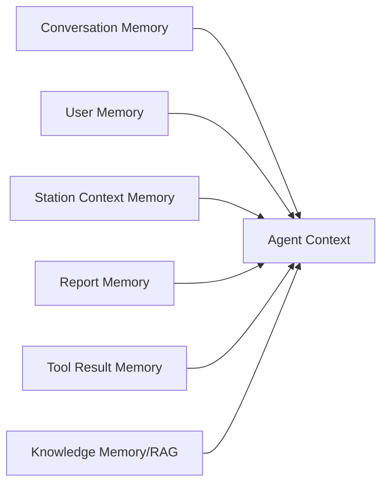
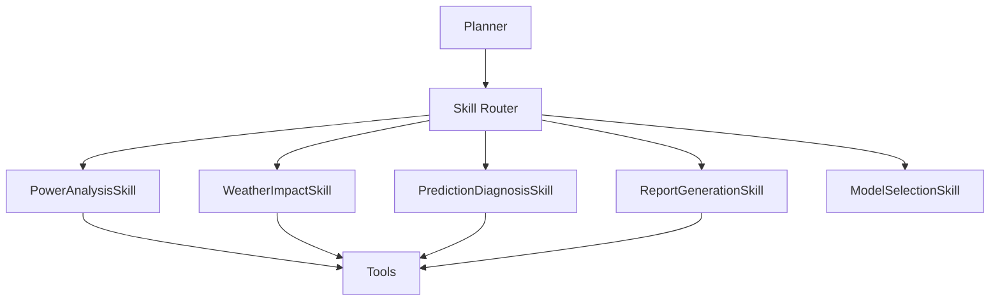
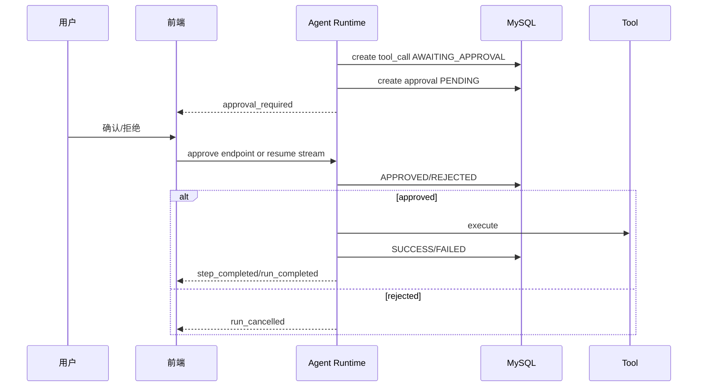

# TARGET_AGENT_ARCHITECTURE

目标版本：光伏智能运维 Agent  
定位：不是普通聊天机器人，而是能规划、调用平台工具、形成业务结论、生成正式报告的项目级智能体。

## 1. 目标总架构

```mermaid
flowchart TD
    U[用户] --> UI[/reports Agent 工作台]
    UI --> API[Agent API / SSE]
    API --> RT[Agent Runtime]
    RT --> MEM[Memory]
    RT --> PL[Planner]
    PL --> SK[Skill Router]
    SK --> TS[Tool Registry]
    RT --> EX[Executor]
    EX --> TS
    TS --> BT[Business Tools]
    BT --> BS[Business Services]
    BS --> DB[(MySQL)]
    BS --> EXT[Weather / Model Service / External APIs]
    EX --> ART[Artifacts]
    RT --> EV[Evaluator]
    EV --> RT
    RT --> UI
```

核心原则：

1. 用户会话属于用户，不属于电站。
2. 电站、任务、报告只是 Agent 在任务中使用的业务对象。
3. Agent 必须有显式运行状态：Run、Step、ToolCall、Artifact、Approval。
4. 业务问题优先工具，工具失败如实说明。
5. 写操作必须确认。
6. 最终回答必须可追溯到工具结果或知识库。

## 2. Agent Runtime

### 职责

`AgentRuntime` 是 Agent 的生命周期协调器，取代当前 `AgentOrchestratorService` 中过重的职责。

负责：

- 创建 Agent Run。
- 绑定 session/user/request。
- 加载 Memory。
- 调用 Planner。
- 调用 Skill 或 Tool Executor。
- 推送 SSE。
- 保存 Run/Step/Artifact。
- 管理审批暂停与恢复。
- 调用 Evaluator 验证最终回答。

### 建议接口

```java
public interface AgentRuntime {
    AgentRun start(AgentRequest request, SseEmitter emitter);
    AgentRun resumeApproval(Long approvalId, ApprovalDecision decision, SseEmitter emitter);
}
```

### Run 状态

```text
CREATED
PLANNING
WAITING_APPROVAL
RUNNING
SYNTHESIZING
COMPLETED
FAILED
CANCELLED
```

### Runtime 输入

```json
{
  "sessionId": 1,
  "message": "分析 2 号电站今天功率波动，结合天气和预测",
  "mode": "auto",
  "context": {},
  "preferredTool": null,
  "toolArguments": null
}
```

### Runtime 输出事件

正式 SSE 事件建议：

| 事件 | 用途 |
| - | - |
| `run_started` | 创建运行 |
| `step_started` | 某步骤开始 |
| `step_completed` | 某步骤完成 |
| `step_failed` | 某步骤失败 |
| `approval_required` | 需要确认 |
| `artifact_created` | 产生业务结果，例如图表/报告 |
| `answer_delta` | 流式回答 |
| `run_completed` | 完成 |
| `run_failed` | 失败 |

兼容旧事件：

- `started` -> `run_started`
- `thinking` / `plan` -> `step_started`
- `tool_call` -> `step_started(type=TOOL)`
- `tool_result` -> `step_completed(type=TOOL)`
- `final` -> `run_completed`

## 3. Planner

### 职责

Planner 理解用户任务，并输出可执行计划。它不直接执行业务 Service。

负责：

- 判断是否业务任务。
- 识别意图。
- 提取业务对象。
- 判断缺失参数。
- 选择 Skill 或 Tool。
- 规划多步骤。
- 给出每一步目的。

### Planner 分层

```text
PlannerFacade
├── SlashPlanner
├── RuleBasedPlanner
├── SkillPlanner
└── LlmPlanner
```

优先级：

```text
slash command > explicit preferred tool > deterministic business rule > skill planner > LLM planner
```

注意：当前代码是 `preferredTool > slash > natural`，目标版本建议改为 slash 优先，因为用户显式输入 `/weather 2` 时不应被前端 preferredTool 覆盖。

### Plan 对象

```json
{
  "intent": "POWER_FLUCTUATION_ANALYSIS",
  "summary": "分析2号电站今日功率波动原因",
  "missingFields": [],
  "requiresApproval": false,
  "steps": [
    {
      "stepId": "s1",
      "type": "TOOL",
      "toolName": "station.detail",
      "arguments": {"stationId": 2},
      "purpose": "确认电站基础信息"
    },
    {
      "stepId": "s2",
      "type": "TOOL",
      "toolName": "power.history",
      "arguments": {"stationId": 2, "range": "today"},
      "purpose": "读取今日功率曲线"
    },
    {
      "stepId": "s3",
      "type": "TOOL",
      "toolName": "weather.current",
      "arguments": {"stationId": 2},
      "purpose": "判断天气影响"
    },
    {
      "stepId": "s4",
      "type": "TOOL",
      "toolName": "prediction.list",
      "arguments": {"stationId": 2},
      "purpose": "查找最近预测任务"
    },
    {
      "stepId": "s5",
      "type": "REASONING",
      "purpose": "综合分析波动原因"
    }
  ]
}
```

### 典型规划示例

用户：

```text
分析今天2号电站发电下降原因
```

Planner：

1. 查询电站详情。
2. 查询今日功率历史。
3. 查询天气当前和预报。
4. 查询最近预测任务。
5. 对比实际功率和预测功率。
6. 生成原因判断和运维建议。

## 4. Memory

### Memory 类型



### Conversation Memory

来源：

- `agent_message`
- `agent_tool_call`
- `agent_approval`
- 新增 `agent_session_summary`

用途：

- 最近对话。
- 当前任务摘要。
- 已查过哪些数据。
- 用户刚刚确认/拒绝了什么。

### User Memory

建议表：`agent_user_memory`

字段：

- `memory_id`
- `user_id`
- `memory_key`
- `memory_value_json`
- `source`
- `confidence`
- `created_at`
- `updated_at`

示例：

```json
{
  "preferredReportStyle": "formal_markdown",
  "defaultIncludeWeather": true,
  "defaultIncludePrediction": true,
  "frequentStationIds": [2, 5]
}
```

### Station Context Memory

建议表：`agent_station_context`

用途：

- 最近访问电站。
- 最近预测任务。
- 最近报告。
- 常见异常。
- 关注指标。

注意：这是上下文记忆，不是“会话绑定电站”。会话仍属于用户。

### Knowledge Memory

来源：

- 平台使用文档。
- 模型说明。
- 运维手册。
- 历史报告。
- 常见故障库。

可先做 MySQL 全文/简单检索，后续接向量库。

## 5. Tool Registry

目标工具定义：

```json
{
  "name": "weather.current",
  "displayName": "查询当前天气",
  "category": "WEATHER",
  "description": "按 stationId 查询电站实时天气",
  "inputSchema": {
    "type": "object",
    "required": ["stationId"],
    "properties": {
      "stationId": {"type": "integer"}
    }
  },
  "outputSchema": {
    "type": "object",
    "properties": {
      "weather": {"type": "string"},
      "temperature": {"type": "number"},
      "humidity": {"type": "number"},
      "cloudiness": {"type": "number"},
      "impact": {"type": "string"}
    }
  },
  "permission": "READ_ONLY",
  "riskLevel": "LOW",
  "requiresApproval": false,
  "enabled": true
}
```

### Tool Context

目标 `ToolExecutionContext`：

```text
currentUserId
username
roles
sessionId
runId
stepId
requestId
memory
currentStationId
currentTaskId
currentReportId
locale
timezone
```

### Tool Result

目标 `ToolExecutionResult`：

```json
{
  "success": true,
  "displayName": "查询当前天气",
  "summary": "当前天气多云，温度31.5℃，云量变化可能带来功率波动",
  "highlights": ["天气：多云", "温度：31.5℃", "发电影响：云量变化可能带来功率波动"],
  "data": {},
  "artifact": null,
  "errorCode": null,
  "errorMessage": null,
  "durationMs": 345
}
```

当前已有 `displayName/summary/highlights/data/errorMessage`，下一步主要补 `artifact`、`durationMs` 统一放入 result、outputSchema。

## 6. Business Tools 目标清单

### 第一优先级

| Tool | 用途 | 当前状态 |
| - | - | - |
| `power.current` | 当前功率和今日发电量 | 缺失 |
| `power.history` | 功率历史曲线 | 缺失 |
| `power.comparePrediction` | 实际 vs 预测 | 缺失 |
| `power.anomaly` | 波动/异常检测 | 缺失 |
| `weather.forecast` | 电站天气预报 | 缺失 |
| `station.status` | 电站运行状态摘要 | 缺失 |

### 已有但需升级

| Tool | 升级点 |
| - | - |
| `station.detail` | 输出标准化 station artifact |
| `weather.current` | 增加 cloudiness/precipitation/irradiance 对发电影响 |
| `prediction.list` | 支持自动返回最新成功任务 |
| `prediction.detail` | 输出趋势、峰值、波动、异常点 |
| `report.generate` | 支持从 Agent artifacts 生成报告，而不仅依赖 station/task |
| `api.usage` | 使用 usage summary/trend/by-key，而不是只看最近 logs |

## 7. Skill System

### Skill 架构



### Skill Definition

```json
{
  "name": "PowerAnalysisSkill",
  "description": "分析电站功率波动、发电下降和异常原因",
  "intents": ["POWER_FLUCTUATION_ANALYSIS", "POWER_DROP_DIAGNOSIS"],
  "requiredTools": ["station.detail", "power.history"],
  "optionalTools": ["weather.current", "weather.forecast", "prediction.list", "prediction.detail"],
  "outputSections": ["摘要", "功率变化", "天气影响", "预测对比", "异常判断", "建议"]
}
```

### PowerAnalysisSkill 流程

1. 确认 stationId；缺失则查询 `station.list` 或追问。
2. 查询 `station.detail`。
3. 查询 `power.history`。
4. 若用户提到天气或功率波动，查询 `weather.current/forecast`。
5. 查询 `prediction.list`，选择最近成功任务。
6. 如有任务，查询 `prediction.detail`。
7. 对比实际功率和预测功率。
8. 输出结构化分析。

## 8. Artifact

Artifact 是 Agent 产生的业务结果，区别于聊天文本。

建议新增 `agent_artifact` 表：

| 字段 | 说明 |
| - | - |
| `artifact_id` | 主键 |
| `session_id` | 会话 |
| `run_id` | 运行 |
| `user_id` | 用户 |
| `type` | WEATHER_SUMMARY / POWER_CHART / PREDICTION_SUMMARY / REPORT_DRAFT |
| `title` | 标题 |
| `content_json` | 内容 |
| `created_at` | 创建时间 |

前端可展示：

- 天气摘要卡
- 功率曲线图
- 预测趋势卡
- 报告草稿
- 可打印正式报告

## 9. 用户确认

确认机制目标：



建议改造：

- `POST /api/agent/approvals/{id}/approve` 只做状态变更可以保留。
- 新增 `POST /api/agent/runs/{runId}/resume` 或让 approve 接口直接返回可继续的 SSE URL/状态。
- 前端不应伪造一条“继续执行已确认的操作”用户消息；应作为系统运行续跑。

## 10. 前端目标工作台

### 页面结构

```text
左侧主导航（已有）
└── /reports
    ├── 会话侧栏
    │   ├── 新建会话
    │   ├── 最近会话
    │   └── 已归档
    └── 主工作区
        ├── 顶部：Agent 标题 / 连接状态 / 用户入口
        ├── 消息流
        │   ├── user message
        │   ├── assistant run card
        │   ├── tool step cards
        │   ├── approval card
        │   ├── artifacts
        │   └── final markdown answer
        └── composer
            ├── slash command menu
            └── input
```

### 组件拆分

```text
web-frontend/src/components/agent
├── AgentWorkbench.vue
├── AgentSessionSidebar.vue
├── AgentMessageList.vue
├── AgentMessageBubble.vue
├── AgentRunCard.vue
├── AgentStepList.vue
├── AgentToolCard.vue
├── AgentApprovalCard.vue
├── AgentArtifactCard.vue
├── AgentMarkdown.vue
└── AgentComposer.vue
```

### 展示原则

- 不展示 payload/response/rawOutput。
- 不展示 sessionId/toolCallId 等技术字段。
- 工具结果展示 `summary/highlights/artifact`。
- 过程在当前 assistant 消息顶部滚动更新。
- 会话属于用户，电站只是任务参数。
- Slash command 是自然入口，不是调试命令。

## 11. Evaluation

目标评估层：

| 评估项 | 检查方式 |
| - | - |
| 业务问题是否调用工具 | 检查 run steps |
| 是否调用错误工具 | intent 与 tool 对照 |
| 最终回答是否引用工具结果 | answer grounding verifier |
| 工具失败是否如实说明 | failure-aware final checker |
| 写操作是否确认 | approval policy checker |
| 缺参是否追问 | missing field checker |
| 是否泄露 token/key | sensitive data scanner |

建议保留并升级 `scripts/agent-e2e-test.mjs`，让它读取 `AGENT_TEST_TOKEN`，对 SSE 事件序列做断言。

## 12. 目标开发完成后的体验

用户输入：

```text
分析 2 号电站今天功率波动，结合天气和预测
```

Agent 展示：

```text
正在分析任务
✓ 确认电站：2号电站
✓ 读取今日功率曲线：发现 13:20-14:00 下滑
✓ 获取天气：多云，云量增加
✓ 获取预测任务：最近成功任务 #8
✓ 对比预测：实际功率低于预测约 12%
```

最终回答：

```text
## 综合结论
2号电站今天的功率波动主要集中在午后时段，结合天气和预测结果，较可能与云量变化导致的短时辐照度下降有关。

## 关键发现
...

## 运维建议
...
```

这才是目标形态：用户看到 Agent 在完成一个业务任务，而不是看到接口调试过程。
