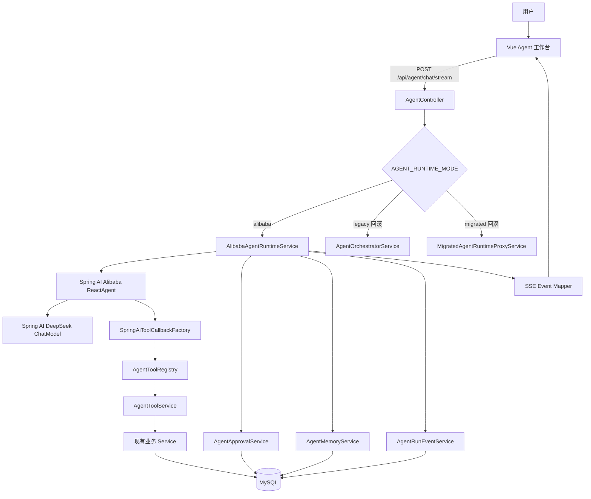

# 光伏平台 Agent 基于 Spring AI Alibaba Agent Framework 的升级改造实施方案

> 文档版本：v1.0  
> 编制日期：2026-07-14  
> 适用项目：PV Power Platform / 光伏平台 Agent  
> 实施周期：2–3 天  
> 执行方式：Codex 辅助开发，以当前仓库真实代码为准  
> 目标框架：Spring AI Alibaba Agent Framework（`ReactAgent`）  
> 模型：继续使用现有 DeepSeek，不强制切换阿里云百炼模型

---

## 1. 文档定位

本文是当前光伏平台 Agent 的**升级改造实施基线**。后续 Codex 应以本文为主要依据完成代码分析、方案细化、开发、测试和迁移，不得脱离现有项目重新搭建一套演示工程。

本次改造不是重新开发 Agent，也不是简单增加一个 Maven 依赖，而是：

1. 使用 Spring AI Alibaba Agent Framework 接管 Agent 的推理—工具调用循环。
2. 保留现有业务工具、权限、确认、会话、消息、数据库、SSE 和 Generative UI。
3. 将当前自研的 LLM JSON 决策和 Python Runtime 逐步收敛为标准 Java Agent Runtime。
4. 在 2–3 天内完成一条可稳定演示、可回滚、可验证的垂直链路。
5. 在框架接入成功后，再决定是否彻底删除旧 Runtime。

---

## 2. 当前系统评估

### 2.1 已有能力

当前项目已经具备较完整的 Agent 基础设施：

- `/reports` Agent 工作台。
- SSE 流式消息。
- 会话、消息、工具调用、确认和长期记忆落库。
- Spring Boot Agent Gateway。
- `AgentToolRegistry`、`AgentToolService`、`AgentApprovalService`。
- `legacy` 自研 Agent Runtime。
- `migrated` Python Agent Runtime。
- Skill、Plan、Tool Router、Memory。
- 电站、天气、预测、功率、报告、模型、云图、API、新闻、通知、钱包、套餐、用户资料等真实工具。
- 写操作确认机制。
- Vue 白名单 Generative UI。
- JWT、用户归属、角色和电站权限控制。

因此，本次改造的重点不是“补功能”，而是**替换 Agent 决策与循环执行层**。

### 2.2 当前主要问题

#### 问题一：存在两套 Runtime

当前同时存在：

- `legacy`：Spring Boot 内置规则、正则、LLM JSON 决策和工具循环。
- `migrated`：Python Runtime、计划、Skill、Tool Router 和 SSE 事件。

两套 Runtime 会带来：

- 行为不一致。
- Prompt 和工具描述重复。
- 调试链路过长。
- Spring 与 Python 间多一次网络转发。
- 工具上下文和权限信息需要跨服务传递。
- 维护成本高。
- 最终难以说明“系统到底使用哪套 Agent 框架”。

#### 问题二：自研 JSON 决策不够稳定

当前 `legacy` 依赖模型输出自定义 JSON，再由代码解析：

```text
用户输入
  -> Prompt
  -> 模型输出自定义 JSON
  -> 解析工具名称和参数
  -> 执行工具
  -> 再次请求模型
```

这种方式存在：

- 模型可能输出非标准 JSON。
- 工具参数容易缺失或类型错误。
- 多轮工具调用需要自己维护。
- 异常、重试、迭代上限和历史消息都要自己实现。
- 模型更像在执行固定工作流，而不是根据观察结果动态决策。

#### 问题三：Python Runtime 与现有 Spring 业务层重复

Python Runtime 目前不直接访问数据库，而是通过 Spring 内部 Gateway 调用工具、LLM 和 Memory。虽然安全边界清晰，但在当前课程项目和 2–3 天工期下，链路偏重：

```text
Vue
  -> Spring AgentController
  -> Python Runtime
  -> Spring Internal Gateway
  -> Java Tool
  -> Business Service
```

目标架构可缩短为：

```text
Vue
  -> Spring AgentController
  -> Spring AI Alibaba ReactAgent
  -> Java Tool Adapter
  -> Business Service
```

#### 问题四：执行轨迹未完全持久化

当前最终消息、工具调用和确认已经落库，但以下事件主要存在于前端运行态：

- run_started
- step_started
- step_completed
- ui_instruction
- run_completed
- error recovery

页面刷新后不能完整恢复 Agent 执行轨迹。

#### 问题五：工具数量多，但工具描述和选择策略仍需标准化

当前工具已经覆盖大量业务，但 Agent 的效果不仅取决于“工具数量”，还取决于：

- 工具名称是否清晰。
- 描述是否说明适用条件。
- 参数是否有明确语义。
- 返回值是否简洁且结构稳定。
- 是否区分读操作与写操作。
- 是否按权限动态过滤。
- 是否避免把几十个无关工具一次性全部交给模型。

---

## 3. 技术决策

### 3.1 核心决策

本次采用：

```text
Spring AI Alibaba Agent Framework
        +
ReactAgent
        +
Spring AI DeepSeek ChatModel
        +
现有 AgentToolRegistry / AgentToolService
        +
现有 Approval / Memory / SSE / Generative UI
```

### 3.2 为什么选择 ReactAgent

`ReactAgent` 已经提供标准 ReAct 循环：

```text
模型推理
  -> 选择工具
  -> 执行工具
  -> 获取观察结果
  -> 再次推理
  -> 继续调用工具或输出最终答案
```

框架负责：

- 标准 Tool Calling。
- 多轮工具循环。
- 模型消息和工具响应拼接。
- 最大调用次数限制。
- Hooks 和 Interceptors。
- 流式节点输出。
- 状态和 Checkpoint 扩展能力。
- Human-in-the-loop 扩展能力。
- 工具重试和错误处理扩展能力。

### 3.3 模型决策

继续使用当前 DeepSeek。

不要求新增 DashScope API Key，也不要求切换 Qwen。框架层使用 Spring AI 的 `ChatModel` 抽象，模型可继续配置为：

```text
deepseek-v4-flash
```

如现有项目已稳定使用其他 DeepSeek 模型，则先保持原配置，不在框架迁移期间同时更换模型。

### 3.4 Runtime 切换策略

不得在第一步直接删除 `legacy` 和 `migrated`。

新增第三种模式：

```text
AGENT_RUNTIME_MODE=alibaba
```

迁移期间保留：

```text
legacy   -> 回滚路径
migrated -> 对照和回滚路径
alibaba  -> 新框架路径
```

完成端到端测试后：

```text
默认模式改为 alibaba
```

课程提交稳定后，再删除或归档旧 Runtime。

---

## 4. 改造目标与非目标

### 4.1 必须完成

1. Spring Boot 内成功引入 Spring AI Alibaba Agent Framework。
2. 使用 `ReactAgent` 建立标准 ReAct 工具调用循环。
3. DeepSeek 继续作为模型。
4. 复用现有 `AgentToolRegistry`，不得复制整套业务工具。
5. 读工具由 Agent 自主选择并执行。
6. 写工具继续经过现有确认机制。
7. 原 `/api/agent/chat/stream` 接口保持兼容。
8. 原 Vue 前端不需要更换接口。
9. 将框架流式事件映射为现有 SSE 协议。
10. 新增 Agent 运行事件落库。
11. 跑通第一条真实垂直链路。
12. 完成至少 10 条真实 E2E 用例。
13. 支持配置切回旧 Runtime。

### 4.2 本周期不做

以下内容不属于本次 2–3 天范围：

- 多 Agent。
- `SequentialAgent`、`ParallelAgent`、`RoutingAgent` 的正式业务化。
- MCP Server/Client 改造。
- 向量数据库。
- RAG。
- Nacos Agent 注册。
- Spring AI Alibaba Admin 平台部署。
- 独立 Next.js `agent-web` 迁移。
- 全量重写前端。
- 将所有 Admin 接口暴露为工具。
- 删除所有旧代码。
- 重新设计全部数据库表。
- 暴露模型原始思维链。

---

## 5. 目标架构



---

## 6. 推荐目录结构

在现有 `backend` 中新增目录，不要建立新的独立工程：

```text
backend/src/main/java/com/example/pvplatform/module/agent/
├── controller/
│   └── AgentController.java
├── runtime/
│   ├── AgentRuntime.java
│   ├── AgentRuntimeRouter.java
│   ├── legacy/
│   ├── migrated/
│   └── alibaba/
│       ├── AlibabaAgentRuntimeService.java
│       ├── AlibabaReactAgentFactory.java
│       ├── AlibabaAgentProperties.java
│       ├── AgentPromptFactory.java
│       ├── AgentRunnableConfigFactory.java
│       ├── stream/
│       │   ├── AlibabaAgentStreamMapper.java
│       │   └── AgentSseEventPublisher.java
│       ├── tool/
│       │   ├── SpringAiToolCallbackFactory.java
│       │   ├── AgentToolCallbackAdapter.java
│       │   ├── AgentToolContextFactory.java
│       │   ├── AgentToolResultSerializer.java
│       │   └── AgentDynamicToolSelector.java
│       ├── interceptor/
│       │   ├── AgentToolErrorInterceptor.java
│       │   ├── AgentToolAuditInterceptor.java
│       │   ├── AgentWriteApprovalInterceptor.java
│       │   └── AgentSensitiveOutputInterceptor.java
│       ├── skill/
│       │   ├── AgentSkillLoader.java
│       │   └── AgentSkillSelector.java
│       └── event/
│           ├── AgentRunEventService.java
│           └── AgentRunRecoveryService.java
├── tool/
├── service/
└── repository/
```

### 6.1 引入统一 Runtime 接口

建议定义：

```java
public interface AgentRuntime {

    String name();

    Flux<ServerSentEvent<String>> stream(AgentRunRequest request);

    default boolean supports(String mode) {
        return name().equalsIgnoreCase(mode);
    }
}
```

然后：

- `LegacyAgentRuntimeAdapter`
- `MigratedAgentRuntimeAdapter`
- `AlibabaAgentRuntimeService`

均实现该接口。

`AgentController` 不再直接写大量 `if/else`，统一交给 `AgentRuntimeRouter`。

---

## 7. 环境与依赖

### 7.1 环境要求

接入前必须检查：

```bash
java -version
mvn -version
```

要求：

- JDK 17 或更高。
- Maven 3.8 或更高。
- Spring Boot 版本与 Spring AI 依赖兼容。
- 不允许为了接入框架盲目升级整个项目的 Spring Boot 主版本。

### 7.2 接入前检查

Codex 必须先执行：

```bash
cd backend
mvn -q help:evaluate -Dexpression=project.version -DforceStdout
mvn dependency:tree
mvn -q -DskipTests compile
```

重点检查：

- 当前 Spring Boot 版本。
- Reactor 版本。
- Jackson 版本。
- Spring AI 是否已存在。
- 是否存在旧版 `FunctionCallback`。
- 是否有 WebFlux 与 Spring MVC 冲突。
- 是否已有自定义 DeepSeek SDK。

### 7.3 推荐依赖基线

优先使用稳定版本线，不使用 `2.0.0-M*` 里程碑版本。

建议基线：

```xml
<properties>
    <spring-ai.version>1.1.2</spring-ai.version>
    <spring-ai-alibaba-agent.version>1.1.2.0</spring-ai-alibaba-agent.version>
</properties>
```

依赖：

```xml
<dependencyManagement>
    <dependencies>
        <dependency>
            <groupId>org.springframework.ai</groupId>
            <artifactId>spring-ai-bom</artifactId>
            <version>${spring-ai.version}</version>
            <type>pom</type>
            <scope>import</scope>
        </dependency>
    </dependencies>
</dependencyManagement>

<dependencies>
    <dependency>
        <groupId>com.alibaba.cloud.ai</groupId>
        <artifactId>spring-ai-alibaba-agent-framework</artifactId>
        <version>${spring-ai-alibaba-agent.version}</version>
    </dependency>

    <dependency>
        <groupId>org.springframework.ai</groupId>
        <artifactId>spring-ai-starter-model-deepseek</artifactId>
    </dependency>
</dependencies>
```

> 版本约束：Codex 应以当前 `pom.xml` 和 Maven 实际可解析结果为准。如果发生版本冲突，只能在同一稳定版本线内调整，并在改造报告中记录最终版本。不得直接使用 `LATEST`、快照版或里程碑版。

### 7.4 DeepSeek 配置

保留现有：

```text
DEEPSEEK_API_KEY
DEEPSEEK_MODEL
```

建议配置：

```yaml
spring:
  ai:
    model:
      chat: deepseek
    deepseek:
      api-key: ${DEEPSEEK_API_KEY}
      base-url: ${DEEPSEEK_BASE_URL:https://api.deepseek.com}
      chat:
        model: ${DEEPSEEK_MODEL:deepseek-v4-flash}
        max-tokens: ${AGENT_MODEL_MAX_TOKENS:4096}

agent:
  runtime:
    mode: ${AGENT_RUNTIME_MODE:legacy}
    alibaba:
      enabled: ${AGENT_ALIBABA_ENABLED:true}
      max-model-calls: ${AGENT_MAX_MODEL_CALLS:6}
      max-tool-calls: ${AGENT_MAX_TOOL_CALLS:12}
      tool-timeout-ms: ${AGENT_TOOL_TIMEOUT_MS:15000}
      read-tool-retry-count: ${AGENT_TOOL_RETRY_COUNT:1}
      persist-events: ${AGENT_EVENT_PERSIST_ENABLED:true}
      expose-reasoning: false
```

### 7.5 不新增的环境

第一阶段不需要：

- 新服务器。
- Redis。
- Nacos。
- Docker 新容器。
- Python 新环境。
- DashScope Key。
- 向量数据库。

当前 Python Runtime 可继续保留，但 `alibaba` 模式不依赖它。

---

## 8. 工具层改造

### 8.1 核心原则

不得把所有业务 Tool 重新写一遍。

应新增一个适配层：

```text
现有 AgentToolRegistry
      ->
SpringAiToolCallbackFactory
      ->
ToolCallback[]
      ->
ReactAgent
```

### 8.2 工具适配器职责

`SpringAiToolCallbackFactory` 负责：

1. 从 `AgentToolRegistry` 读取工具元数据。
2. 根据当前用户角色和权限过滤工具。
3. 根据当前 Skill 过滤工具范围。
4. 把工具名称、描述和 JSON Schema 转换为 Spring AI `ToolCallback`。
5. 调用时委托给现有 `AgentToolService`。
6. 注入 `userId`、`sessionId`、`messageId`、`runId`、角色。
7. 保持原工具调用落库。
8. 保持结果脱敏。
9. 将异常转换为模型可理解的结构化结果。

### 8.3 ToolContext

每次 Agent 运行必须构造上下文：

```java
Map<String, Object> context = Map.of(
    "userId", userId,
    "sessionId", sessionId,
    "messageId", messageId,
    "runId", runId,
    "roles", roles,
    "runtime", "alibaba"
);
```

禁止让模型传入：

- userId
- role
- ownerUserId
- sessionId
- approvalId
- 权限级别

这些参数只能由服务端上下文注入。

### 8.4 工具命名规范

保持当前点号命名可以继续使用，例如：

```text
station.list
station.detail
weather.current
weather.forecast
pv.realtime
pv.history
prediction.list
prediction.detail
report.generate
```

但必须确保框架和模型实际支持工具名称中的点号。如果当前模型或框架对工具名有限制，则在适配层转换：

```text
station.detail -> station_detail
```

同时维护映射，数据库仍记录原业务工具名。

### 8.5 工具描述标准

每个工具描述必须包含：

1. 工具用途。
2. 什么时候应该使用。
3. 什么时候不应该使用。
4. 必填参数。
5. 返回数据含义。
6. 是否属于写操作。
7. 失败时如何处理。

示例：

```text
工具：station.detail

用途：
查询当前用户有权限访问的单个内部光伏电站详细信息。

使用条件：
用户明确提到电站 ID，或已通过 station.list 得到唯一电站 ID。

禁止：
不得用本工具查询 PVOutput 公开电站；
不得猜测 stationId；
缺少 ID 时先调用 station.list 或向用户追问。

参数：
stationId：内部电站主键，Long，必填。

返回：
电站名称、容量、位置、状态、经纬度和用户权限。
```

### 8.6 工具参数对象

禁止继续大量使用：

```java
Map<String, Object>
```

优先为核心工具建立明确请求对象：

```java
public record StationDetailRequest(
    @ToolParam(description = "内部电站主键") Long stationId
) {}
```

第一阶段至少改造以下核心工具参数：

- `station.detail`
- `weather.current`
- `pv.history`
- `prediction.list`
- `prediction.detail`
- `report.generate`

### 8.7 动态工具选择

不得每次把全部工具交给模型。

根据意图或 Skill 选择工具组：

```text
station-inspection:
  station.list
  station.detail
  weather.current
  weather.forecast
  pv.realtime
  pv.history
  prediction.list
  prediction.detail

report-generation:
  station.detail
  weather.current
  pv.history
  prediction.list
  prediction.detail
  report.generate

profile-management:
  user.profile
  user.profile.update

marketplace:
  wallet.balance
  marketplace.list
  marketplace.purchase
```

默认单次暴露工具数建议不超过 12 个。

---

## 9. ReactAgent 构建

### 9.1 Agent Factory

`AlibabaReactAgentFactory` 根据当前用户、会话和 Skill 动态构造 Agent。

伪代码：

```java
public ReactAgent create(AgentRunContext runContext) {
    List<ToolCallback> tools =
        toolCallbackFactory.createTools(runContext);

    RunnableConfig config =
        runnableConfigFactory.create(runContext);

    return ReactAgent.builder()
        .name("pv_platform_agent")
        .model(chatModel)
        .systemPrompt(promptFactory.build(runContext))
        .tools(tools.toArray(ToolCallback[]::new))
        .hooks(modelCallLimitHook)
        .interceptors(
            toolAuditInterceptor,
            toolErrorInterceptor,
            writeApprovalInterceptor
        )
        .saver(memorySaver)
        .build();
}
```

### 9.2 调用限制

必须配置最大循环次数，避免失控：

```text
最大模型调用次数：6
最大工具调用次数：12
单工具超时：15 秒
读工具失败重试：1 次
写工具自动重试：0 次
```

### 9.3 错误终止条件

出现以下情况时停止继续循环：

- 同一工具以相同参数连续失败 2 次。
- 连续 2 次工具结果均为参数缺失。
- 达到模型调用上限。
- 达到工具调用上限。
- 用户无权限。
- 写操作进入等待确认。
- 用户主动取消。
- 模型返回空响应 2 次。

---

## 10. Prompt 设计

### 10.1 System Prompt 目标

System Prompt 不应只描述“你是光伏助手”，而应约束 Agent 的工作方式。

建议包含以下内容：

```text
你是光伏平台的业务 Agent。你的职责是基于系统提供的真实工具完成电站查询、
天气分析、功率分析、预测分析、报告生成和用户业务操作。

工作规则：

1. 涉及实时数据、数据库数据、用户资料、余额、套餐、天气、功率、预测和报告时，
   必须优先使用工具，不得凭空生成数据。
2. 工具结果是事实来源。工具未返回的字段不得猜测。
3. 缺少必要参数时，优先通过已有上下文、默认电站或查询类工具补全；
   仍无法确定时只追问一个最关键问题。
4. 对复杂任务动态决定下一步，不要机械执行固定工具序列。
5. 工具失败后先判断是参数、权限、数据缺失还是临时网络错误。
6. 不得绕过权限系统。
7. 写操作必须等待用户确认；确认前不得声称操作已完成。
8. 不得暴露 API Key、Token、密码、内部鉴权信息和数据库敏感字段。
9. 最终回答先给结论，再给证据、风险和建议。
10. 不向用户输出隐藏思维链，只输出简洁的执行进度和可验证结果。
```

### 10.2 动态上下文

每次运行注入：

- 当前用户角色。
- 当前会话 ID。
- 当前时间。
- 当前 Skill。
- 用户长期记忆摘要。
- 默认电站。
- 最近有效会话摘要。
- 可使用工具清单。
- 待处理确认状态。

不要把全部历史消息、全部数据库对象和全部工具说明一次性塞进 Prompt。

---

## 11. Skill 改造

### 11.1 保留现有 Skill 文件

当前 `agent-runtime/skills/*/SKILL.md` 不应直接废弃。

将核心 Skill 迁入 Java 可读取目录，例如：

```text
backend/src/main/resources/agent-skills/
├── station-inspection/SKILL.md
├── fault-analysis/SKILL.md
├── report-generation/SKILL.md
├── profile-management/SKILL.md
└── marketplace/SKILL.md
```

### 11.2 第一阶段只迁移 3 个 Skill

必须优先完成：

1. `station-inspection`
2. `report-generation`
3. `profile-management`

其他 Skill 后续迁移。

### 11.3 Skill 内容

每个 Skill 至少包含：

```yaml
name: station-inspection
description: 分析单个电站当前运行状态、天气影响、功率和预测结果
allowed_tools:
  - station.list
  - station.detail
  - weather.current
  - pv.realtime
  - pv.history
  - prediction.list
  - prediction.detail
required_information:
  - stationId
output_sections:
  - 当前状态
  - 数据证据
  - 风险判断
  - 建议
```

### 11.4 Skill 不是固定流程

Skill 只能限定：

- 目标。
- 工具范围。
- 输出要求。
- 安全约束。

不能把 Agent 固定成：

```text
必须先 station.detail
然后 weather.current
然后 prediction.list
```

具体执行顺序应由 ReactAgent 根据结果动态决定。

---

## 12. 写操作与确认机制

### 12.1 第一阶段策略

继续使用现有：

- `AgentApprovalService`
- `agent_approval`
- 前端确认卡
- approve/reject API

不要在 2–3 天内完全替换为框架自带持久化 Human-in-the-loop。

原因：

- 当前确认链路已经可用。
- 框架 Human-in-the-loop 需要可恢复 Checkpointer。
- 直接替换会增加中断恢复、状态映射和数据库迁移风险。

### 12.2 写工具适配行为

模型请求写工具时：

1. 适配器识别该工具 `requiresApproval=true`。
2. 不执行业务写操作。
3. 调用 `AgentApprovalService` 创建确认记录。
4. 写入 `agent_tool_call`，状态设为 `PENDING_APPROVAL`。
5. 返回结构化结果：

```json
{
  "status": "approval_required",
  "approvalId": "xxx",
  "toolName": "report.generate",
  "summary": "将为 1 号电站生成并保存分析报告",
  "arguments": {
    "stationId": 1
  }
}
```

6. SSE 输出 `approval_required`。
7. ReactAgent 本轮停止，不继续执行依赖该写操作的后续步骤。

### 12.3 确认后续跑

用户确认后：

1. 现有 approve API 校验用户、会话、工具和参数。
2. 执行真实写操作。
3. 更新 `agent_tool_call` 和 `agent_approval`。
4. 保存工具结果。
5. 可选：再次调用 `AlibabaAgentRuntimeService.continueAfterApproval(...)`。
6. 将已执行结果作为可信上下文，让 Agent 给出最终总结。

### 12.4 后续增强

框架迁移稳定后，再评估：

- `HumanInTheLoopHook`
- MySQL/Redis Checkpointer
- 原生 interrupt/resume

本周期不强制完成。

---

## 13. Memory 处理

### 13.1 区分三类数据

#### 完整聊天历史

继续使用：

```text
agent_message
```

它是审计和页面恢复的事实来源。

#### Agent 短期上下文

第一阶段可使用：

- 最近 8–12 条有效消息。
- 同一 `threadId=sessionId`。
- ReactAgent `MemorySaver` 仅负责单进程运行状态。

#### 长期用户记忆

继续使用：

```text
agent_memory
AgentMemoryService
```

类型保持：

- user_preference
- default_station
- report_format
- frequent_metric
- recent_context
- station_focus
- ops_preference

### 13.2 不重复存储

不要同时把同一份完整会话写入：

- `agent_message`
- Spring AI ChatMemoryRepository
- Python Memory
- ReactAgent Saver

本阶段明确：

```text
agent_message = 完整历史和审计源
agent_memory  = 长期记忆
MemorySaver   = 当前 Agent 执行状态
```

### 13.3 长期记忆注入

`AgentMemoryService` 返回的长期记忆应先压缩成简短上下文：

```text
用户默认电站：2
偏好报告格式：先结论后数据
常关注指标：日发电量、预测偏差
```

不得把所有历史记忆 JSON 原样传给模型。

---

## 14. SSE 与 Generative UI

### 14.1 保持前端协议兼容

现有前端事件包括：

```text
started
thinking
intent_resolved
plan
tool_call
tool_result
step_started
step_completed
ui_instruction
approval_required
token
final
run_completed
error
```

新 Runtime 继续输出这些类型，避免重写前端。

### 14.2 框架事件映射

| Spring AI Alibaba 输出 | 现有 SSE 事件 |
|---|---|
| Agent 开始运行 | `started` |
| 已选择 Skill | `intent_resolved` |
| Todo/计划摘要 | `plan` |
| 模型请求 ToolCall | `tool_call` |
| Tool 节点开始 | `step_started` |
| ToolResponseMessage | `tool_result` |
| Tool 节点结束 | `step_completed` |
| 模型普通流式内容 | `token` |
| 写工具被拦截 | `approval_required` |
| 最终 AssistantMessage | `final` |
| Flux 完成 | `run_completed` |
| 异常 | `error` |

### 14.3 不暴露原始思维链

如果 DeepSeek 返回 `reasoningContent`：

- 不直接发送到前端。
- 不落完整原始推理文本。
- 可转换为非敏感进度，例如：

```text
正在判断需要查询的数据
正在核对天气与功率变化
正在生成结论
```

`thinking` 事件只能是过程标签，不得包含隐藏推理过程。

### 14.4 Generative UI 生成规则

模型不得直接输出 Vue、HTML 或 JavaScript。

继续使用白名单组件：

- StationSummaryCard
- WeatherImpactCard
- PredictionTrendCard
- PowerMetricCard
- RiskAssessmentCard
- MaintenanceRecommendationCard
- ReportPreviewCard
- ApprovalActionCard
- ToolProgressCard
- ErrorRecoveryCard

UI 指令必须由后端根据工具结果生成或严格校验。

---

## 15. Agent 事件落库

### 15.1 新增单表方案

为了控制工期，先新增一张表：

```sql
CREATE TABLE agent_run_event (
    id BIGINT PRIMARY KEY AUTO_INCREMENT,
    run_id VARCHAR(64) NOT NULL,
    session_id BIGINT NOT NULL,
    user_id BIGINT NOT NULL,
    message_id BIGINT NULL,
    sequence_no INT NOT NULL,
    event_type VARCHAR(50) NOT NULL,
    node_name VARCHAR(100) NULL,
    tool_name VARCHAR(100) NULL,
    tool_call_id BIGINT NULL,
    payload_json JSON NULL,
    event_status VARCHAR(30) NULL,
    created_at DATETIME NOT NULL DEFAULT CURRENT_TIMESTAMP,
    UNIQUE KEY uk_run_sequence (run_id, sequence_no),
    KEY idx_session_created (session_id, created_at),
    KEY idx_run_id (run_id),
    KEY idx_tool_call_id (tool_call_id)
);
```

如当前 MySQL 版本或 ORM 不方便使用 `JSON`，改为 `LONGTEXT`。

### 15.2 必须持久化的事件

至少保存：

```text
run_started
intent_resolved
plan
step_started
tool_call
tool_result
step_completed
ui_instruction
approval_required
final
run_completed
error
```

`token` 增量不逐 token 落库，避免数据膨胀。最终文本仍保存到 `agent_message`。

### 15.3 页面恢复

刷新页面后：

1. 查询 `agent_message`。
2. 查询 `agent_tool_call` 和 `agent_approval`。
3. 查询该会话最近一次 `run_id` 的 `agent_run_event`。
4. 重建步骤时间线和 UI 卡片。
5. 若最后事件不是 `run_completed/error/approval_required`，标记为“执行中断”。

---

## 16. 第一条垂直链路

### 16.1 目标输入

```text
分析 1 号电站当前运行情况，结合天气、实时功率、历史功率和最近预测结果给出风险判断。
```

### 16.2 预期行为

Agent 应根据实际数据动态调用：

```text
station.detail
weather.current
pv.realtime
pv.history
prediction.list
prediction.detail（仅在有预测记录时）
```

不是所有情况下都必须调用全部工具。

### 16.3 最终输出要求

最终回答必须包含：

1. 当前运行结论。
2. 当前功率和关键指标。
3. 天气影响。
4. 历史变化。
5. 预测偏差或预测状态。
6. 风险等级。
7. 建议。
8. 数据缺失说明。

### 16.4 降级行为

- 无电站权限：立即停止并说明权限问题。
- 电站不存在：停止，不继续查天气和预测。
- 天气缺失：继续分析功率和预测，并明确缺失。
- 预测缺失：继续分析实时与历史数据。
- DeepSeek 不可用：返回明确错误，不伪造分析。
- 单个读工具临时失败：允许重试一次。
- 多个核心数据均缺失：不生成“正常运行”结论。

---

## 17. 三天实施计划

## Day 1：框架接入与只读链路

### 上午

1. 创建改造分支。
2. 完成当前代码和依赖基线检查。
3. 引入 Spring AI Alibaba Agent Framework。
4. 引入 Spring AI DeepSeek ChatModel。
5. 新增 `alibaba` Runtime 模式。
6. 建立 `AlibabaReactAgentFactory`。
7. 建立最小 Agent，验证普通对话和 DeepSeek 连通。

### 下午

1. 实现 `SpringAiToolCallbackFactory`。
2. 适配 6 个核心只读工具。
3. 注入用户、会话和权限上下文。
4. 跑通 ReAct 多工具循环。
5. 增加模型调用上限。
6. 增加工具错误转换。
7. 完成第一条垂直链路后端测试。

### Day 1 验收

```text
AGENT_RUNTIME_MODE=alibaba
```

能够完成：

```text
查询 1 号电站并结合天气和预测进行分析
```

并且工具调用由模型原生 Tool Calling 产生，不再解析自定义 JSON。

---

## Day 2：SSE、确认、事件落库

### 上午

1. 实现框架流式输出到现有 SSE 的映射。
2. 保持 `/api/agent/chat/stream` 不变。
3. 保持前端工具卡和进度卡可用。
4. 屏蔽原始 reasoningContent。
5. 新增 `agent_run_event` 表和 Service。

### 下午

1. 适配写工具确认机制。
2. 跑通 `report.generate` 确认链路。
3. 跑通 `user.profile.update` 确认链路。
4. 实现 approve 后结果总结。
5. 实现页面刷新后的事件恢复。
6. 加入异常和降级 UI。

### Day 2 验收

- 读工具自动执行。
- 写工具不自动执行。
- 确认卡可用。
- SSE 事件完整。
- 刷新后可恢复主要执行轨迹。

---

## Day 3：测试、切换和清理

### 上午

1. 跑 10 条 E2E 用例。
2. 修复参数缺失、工具选错和重复调用。
3. 优化工具描述。
4. 优化 System Prompt。
5. 验证不同角色和电站权限。
6. 验证 LLM、天气、预测和工具失败。

### 下午

1. 默认 Runtime 切为 `alibaba`。
2. 保留配置切回 `legacy/migrated`。
3. 更新 README、环境变量和架构文档。
4. 输出迁移报告。
5. 记录未完成事项。
6. 打包答辩演示用测试数据和脚本。

---

## 18. 必须覆盖的 E2E 用例

### 用例 1：完整只读分析

```text
分析 1 号电站当前运行情况，结合天气和最近预测结果。
```

验收：

- 调用正确工具。
- 无静态 Mock。
- 有数据证据。
- 不生成不存在的数据。

### 用例 2：上下文追问

第一轮：

```text
查看 1 号电站。
```

第二轮：

```text
再看看它最近 7 天的功率。
```

验收：

- 正确理解“它”。
- 不再次追问 stationId。

### 用例 3：默认电站

```text
默认 2 号电站。
```

然后：

```text
分析我的默认电站。
```

验收：

- 长期记忆生效。
- 不暴露记忆表内部结构。

### 用例 4：无权限电站

验收：

- 工具返回权限错误。
- Agent 不继续猜测或越权查询。
- 前端显示清晰错误。

### 用例 5：天气数据缺失

验收：

- 继续使用功率和预测。
- 最终明确说明天气数据缺失。

### 用例 6：预测数据为空

验收：

- 不调用不存在的 `prediction.detail`。
- 不伪造预测结果。

### 用例 7：报告生成确认

```text
给 1 号电站生成报告。
```

验收：

- 先查询必要数据。
- 创建确认记录。
- 未确认前不写入报告。
- 确认后生成并返回报告信息。

### 用例 8：拒绝写操作

验收：

- 拒绝后不执行业务写操作。
- 工具调用和确认状态正确落库。
- Agent 明确说明已取消。

### 用例 9：DeepSeek 不可用

验收：

- SSE 返回可识别错误。
- 会话不写入虚假最终答案。
- 旧 Runtime 可配置回滚。

### 用例 10：页面刷新恢复

验收：

- 工具步骤、确认卡、最终结果可恢复。
- 未完成运行显示为中断或等待确认。

---

## 19. 测试要求

### 19.1 单元测试

新增至少：

```text
AlibabaReactAgentFactoryTest
SpringAiToolCallbackFactoryTest
AgentDynamicToolSelectorTest
AgentWriteApprovalInterceptorTest
AlibabaAgentStreamMapperTest
AgentRunEventServiceTest
AgentPromptFactoryTest
```

### 19.2 集成测试

使用 Mock ChatModel 或框架测试模型覆盖：

- 单工具调用。
- 连续多工具调用。
- 工具参数错误。
- 工具异常。
- 达到最大循环次数。
- 写操作确认。
- 工具返回空数据。
- 最终消息落库。

### 19.3 回归测试

必须继续执行现有：

```bash
mvn -q -Dtest=SlashCommandParserTest,UserServiceTest test
mvn -q -Dtest=SlashCommandParserTest,StationPermissionServiceTest test
mvn -q -DskipTests compile
npm run build
python -m pytest -q agent-runtime/tests/test_runtime_foundation.py
```

Python 测试在旧 Runtime 仍保留期间继续执行。

---

## 20. 验收标准

### 20.1 功能验收

- [ ] `alibaba` Runtime 可独立运行。
- [ ] DeepSeek 成功接入 `ChatModel`。
- [ ] ReactAgent 能连续调用多个真实工具。
- [ ] 不再依赖模型输出自定义工具决策 JSON。
- [ ] 现有工具调用记录继续落库。
- [ ] 权限校验没有被绕过。
- [ ] 写操作继续需要确认。
- [ ] 会话和消息继续落库。
- [ ] 长期记忆继续可用。
- [ ] SSE 接口与前端兼容。
- [ ] Generative UI 白名单继续有效。
- [ ] 执行事件可恢复。
- [ ] 第一条垂直链路通过。
- [ ] 10 条 E2E 用例通过。

### 20.2 体验验收

相较旧 Runtime，应看到以下改进：

- Agent 能根据中间结果改变后续工具调用。
- 不需要为每种自然语言写正则。
- 追问更少但更准确。
- 工具失败后能给出明确原因。
- 不会固定调用一整套无关工具。
- 前端可显示真实执行步骤。
- 写操作的确认语义清晰。
- 最终回答引用真实工具数据。
- 连续对话可以理解指代关系。

### 20.3 工程验收

- [ ] 无明文 API Key。
- [ ] 无新增高危公开内部接口。
- [ ] 无直接绕过 Service 访问数据库。
- [ ] 无重复实现整套 Tool。
- [ ] 无使用快照或里程碑依赖。
- [ ] Maven 构建通过。
- [ ] 前端构建通过。
- [ ] 新增代码有测试。
- [ ] 可通过环境变量一键回滚。

---

## 21. 回滚方案

保留：

```text
AGENT_RUNTIME_MODE=legacy
AGENT_RUNTIME_MODE=migrated
AGENT_RUNTIME_MODE=alibaba
```

出现以下情况时暂时回滚：

- Maven 依赖冲突短时间无法解决。
- DeepSeek Tool Calling 与框架适配异常。
- SSE 流式事件无法稳定映射。
- 写操作确认出现越权风险。
- 核心 E2E 未通过。
- 演示环境发生不可恢复错误。

回滚只切换 Runtime 配置，不回滚数据库业务数据。

新增表 `agent_run_event` 可以保留，不影响旧 Runtime。

---

## 22. Codex 执行约束

Codex 开发时必须遵守以下规则。

### 22.1 先分析再修改

开始开发前，必须输出：

1. 当前 Spring Boot、JDK、Spring AI 和 Reactor 版本。
2. 现有 Agent 相关目录。
3. 当前 Tool 接口和元数据结构。
4. 当前 SSE 事件 DTO。
5. 当前 Approval 执行流程。
6. 当前会话和消息落库流程。
7. 预计修改文件列表。
8. 依赖冲突风险。

### 22.2 不允许推倒重写

禁止：

- 新建一个与现有业务无关的 Demo。
- 复制现有 Tool 实现。
- 绕过 `AgentToolService`。
- 绕过 `AgentApprovalService`。
- 绕过权限 Service。
- 修改前端 API 地址。
- 删除旧 Runtime 后再测试。
- 把业务逻辑移动到 Prompt。
- 使用 Mock 数据代替真实接口。
- 把 API Key 写入代码或提交仓库。

### 22.3 小步提交

建议提交顺序：

```text
feat(agent): add alibaba runtime skeleton
feat(agent): integrate deepseek chat model
feat(agent): adapt existing tools to spring ai callbacks
feat(agent): add react agent streaming bridge
feat(agent): persist agent runtime events
feat(agent): bridge write approval workflow
test(agent): add alibaba runtime e2e coverage
docs(agent): document runtime migration and rollback
```

### 22.4 每阶段必须可运行

每完成一个阶段都执行：

```bash
mvn -q -DskipTests compile
mvn test
npm run build
```

不得积累大量未编译代码后一次性修复。

---

## 23. 最终交付物

Codex 最终必须提交：

1. `alibaba` Runtime 代码。
2. Maven 依赖和配置。
3. DeepSeek ChatModel 配置。
4. ToolCallback 适配层。
5. ReactAgent Factory。
6. SSE 事件映射。
7. 写操作确认桥接。
8. Agent 事件落库。
9. 3 个核心 Skill。
10. 单元测试。
11. 10 条 E2E 结果。
12. 数据库迁移 SQL。
13. 环境变量说明。
14. Runtime 切换和回滚说明。
15. 改造前后架构对比。
16. 未完成事项列表。
17. 一份 `docs/agent-alibaba-migration-report.md`。

---

## 24. 最终架构说明口径

答辩时可按以下方式说明：

> 本系统原先采用自研 LLM JSON 决策和 Python Agent Runtime。为了提升 Agent 的标准化、稳定性和可维护性，在保留现有 Spring Boot 业务工具、权限、持久化、写操作确认、SSE 和 Generative UI 的基础上，引入 Spring AI Alibaba Agent Framework，并使用 ReactAgent 实现标准 ReAct 推理与工具调用循环。模型继续使用 DeepSeek，框架通过 Spring AI ChatModel 适配。系统支持动态工具选择、多轮工具调用、上下文记忆、执行轨迹持久化和 Human-in-the-loop 写操作确认，同时保留旧 Runtime 作为回滚路径。

---

## 25. 最终实施结论

本项目不需要重新搭建 Agent，也不需要新增大量运行环境。

最合理的改造路径是：

```text
保留现有业务基础设施
        ↓
增加 Spring AI Alibaba ReactAgent Runtime
        ↓
用适配器复用现有 Tool
        ↓
保持原权限、Approval、Memory 和 SSE
        ↓
先跑通只读垂直链路
        ↓
再桥接写操作确认
        ↓
完成 E2E 后切为默认 Runtime
```

本次改造的成功标准不是“项目里出现 Spring AI Alibaba 依赖”，而是：

> 用户提出复杂光伏业务任务后，Agent 能基于真实工具结果动态决定下一步，在权限和确认约束下完成任务，并将全过程稳定地展示和持久化。

---

## 26. 参考依据

本方案依据以下技术能力设计：

- Spring AI Alibaba Agent Framework 的 `ReactAgent`。
- Spring AI Alibaba Hooks 和 Interceptors。
- Spring AI Alibaba 流式 `StreamingOutput`。
- Spring AI 标准 Tool Calling 与 `ToolCallback`。
- Spring AI DeepSeek ChatModel。
- 当前项目已有 Agent Gateway、Tool Registry、Approval、Memory、SSE、Generative UI 和业务 Service。

版本和 API 在实际编码时必须以项目 Maven 可解析结果和官方稳定文档为准。
